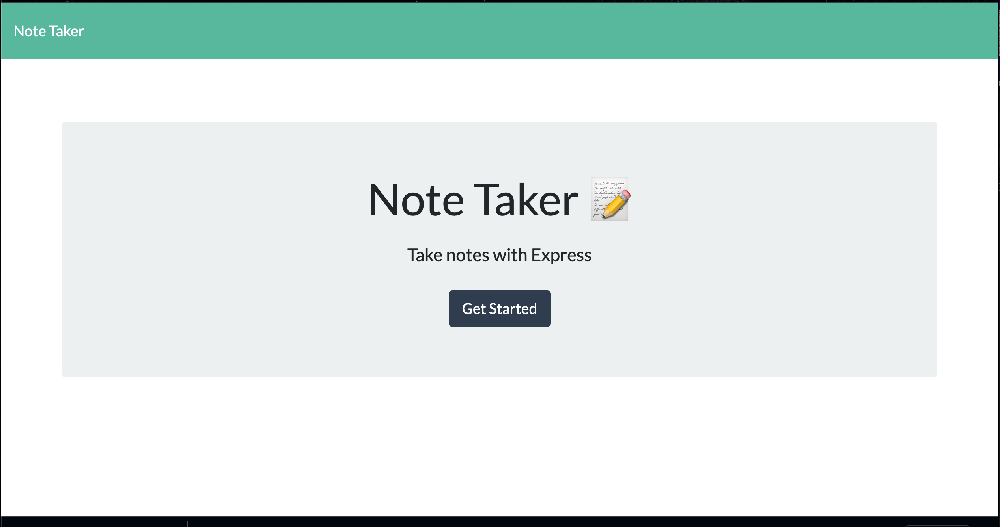

# Note_Taker_App

**What does this application do and why?**

* As a busy person, I like being able to store notes in one place and be able to refer back to them. 
* This app allows the user to add a Note Title and Note Text. 
* When I click the save icon, the note is added to the left hand side of the application so that the may see the note to refer back to. 

**How the application is organized**
The Note_Taker_App is organized in the following files:

**Step-by-Step on how to run the application**
* Enter the app by clicking the button on the home page
* Fill in a title and text for a new note
* Press the save Icon that appears once both fields are filled
* The note should appear on the left hand side
* When I click on a previously made note, it should appear on the main page to see
* When I return to the page, the notes I made will still be there for me to see. 

**What the application looks like**

Link to Video of Application in Use: https://watch.screencastify.com/v/xKTNj6RfA9Vas3UGWvXt;

**Link to deployed version of Chandler's Portfolio**

Deployed Heroku App: https://evening-ravine-54411.herokuapp.com/
GitHub Repository: https://github.com/echandlerdavis/Note_Taker_App 

**Technologies Used** 

* Express
* Express routing
* javascript
* fetch requests
* local api requests
* rudimentary databases